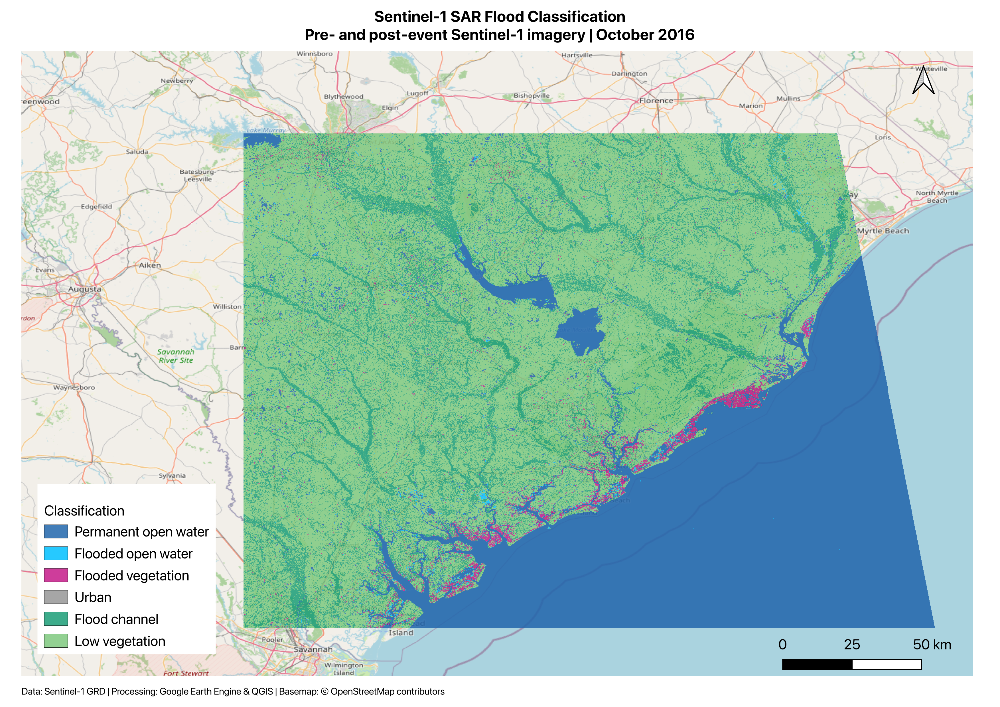

# Sentinel-1 SAR Flood Classification in Google Earth Engine

This project explores flood-related land-cover classification using pre- and post-event Sentinel-1 Synthetic Aperture Radar (SAR) imagery in Google Earth Engine (GEE).

The workflow was adapted from a NASA ARSET hands-on training exercise and modified to use both pre- and post-event VV and VH backscatter as classification inputs. The final classified raster was exported from Google Earth Engine and visualized in QGIS.

## Project Overview

Sentinel-1 SAR imagery was used to examine land-cover conditions before and after a flood event in October 2016.

A supervised CART (Classification and Regression Tree) classifier was trained using manually defined samples representing six land-cover and flood-related classes:

1. Permanent open water
2. Flooded open water
3. Flooded vegetation
4. Urban
5. Flood channel
6. Low vegetation

Both VV and VH polarization from the pre- and post-event observations were included in the classification.

## Workflow

1. Load Sentinel-1 GRD imagery in Google Earth Engine.
2. Filter the collection by study area, acquisition date, orbit direction, spatial resolution, and acquisition mode.
3. Select VV and VH polarization.
4. Create pre- and post-event image mosaics.
5. Apply focal-mean filtering to reduce SAR speckle.
6. Combine the pre- and post-event imagery into a four-band feature stack:
   - Pre-event VV
   - Pre-event VH
   - Post-event VV
   - Post-event VH
7. Extract training samples from manually labelled areas.
8. Train a CART classifier.
9. Classify the study area into six land-cover and flood-related classes.
10. Create a flood-affected mask from the flooded open-water and flooded-vegetation classes.
11. Calculate the estimated area classified as flood-affected.
12. Export the classification as GeoTIFF for visualization and map production in QGIS.

## Data

### Sentinel-1

- Dataset: `COPERNICUS/S1_GRD`
- Acquisition mode: Interferometric Wide Swath (IW)
- Polarizations: VV and VH
- Orbit direction: Ascending
- Spatial resolution filter: 10 m
- Pre-event imagery: 4 October 2016
- Post-event imagery: 16 October 2016

### Additional spatial data

- `TIGER/2016/Roads` was explored in Google Earth Engine for spatial context.
- OpenStreetMap was used as the basemap for the final QGIS visualization.

## Classification

The classifier uses four SAR inputs representing conditions before and after the event:

| Input | Description |
|---|---|
| VV | Pre-event VV backscatter |
| VH | Pre-event VH backscatter |
| VV_1 | Post-event VV backscatter |
| VH_1 | Post-event VH backscatter |

Training samples were manually defined for the six classes and used to train a CART classifier in Google Earth Engine.

The script also reports the CART confusion matrix and resubstitution accuracy. This represents performance on the same samples used for training and therefore should **not** be interpreted as independent validation accuracy.

## Results

The workflow produces a six-class thematic classification from the pre- and post-event Sentinel-1 observations.

For the flood-focused output, areas classified as **flooded open water** and **flooded vegetation** were combined into a flood-affected mask. The classified raster was then exported from Google Earth Engine and visualized in QGIS.

### Final Classification Map



The final map shows the spatial distribution of the six classification classes, with OpenStreetMap providing geographic context.

## Tools

- Google Earth Engine
- JavaScript
- Sentinel-1 SAR
- QGIS

## Limitations

- Training areas were manually defined.
- The CART confusion matrix and accuracy reported by the script are based on the training samples and do not constitute independent validation.
- The resulting flood-affected areas represent classification outputs rather than independently verified flood extent.
- The project was completed as a hands-on remote-sensing exercise and is not intended to represent an operational flood-mapping product.

## Repository Structure

```text
sentinel1-flood-classification-gee/
├── README.md
├── sentinel1_flood_classification.js
└── images/
    └── sentinel1_flood_classification_map.png
```

## Acknowledgement

This project was adapted from a NASA Applied Remote Sensing Training Program (ARSET) hands-on exercise involving SAR-based flood mapping in Google Earth Engine.

The exercise was used to develop practical experience working with Sentinel-1 SAR imagery, pre- and post-event observations, supervised classification in Google Earth Engine, and cartographic visualization in QGIS.
